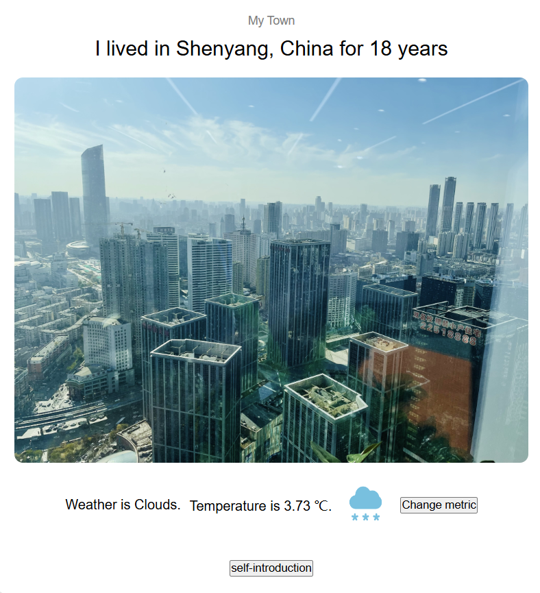

This is Pengyao Zhao's repository for react assignment

In the project directory, you can run:

### `npm start`

Runs the app in the development mode.\
Open [http://localhost:3000](http://localhost:3000) to view it in your browser.

## Screenshots

Here are two screenshots from the project:

